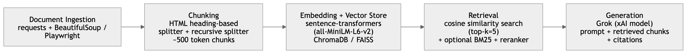

# Project 1 Planning: The Unofficial Guide

---

## Domain

<!-- What domain did you choose? Why is this knowledge valuable and hard to find through official channels? -->

I am choosing academic requirements for UPenn's undergraduate curriculum in the College of Arts and Sciences. The information is spread across various web pages and is hard to consolidate and the number of different requirements and changing requirements in the current AI landscape make it difficult for AI systems to answer domain specific questions related to distributional requirements.

---

## Documents

<!-- List your specific sources: URLs, subreddit names, forum threads, or file descriptions.
     Aim for at least 10 sources that together cover different subtopics or perspectives within your domain. -->

| #   | Source                               | Description                                                    | URL or location                                                                                                                                 |
| --- | ------------------------------------ | -------------------------------------------------------------- | ----------------------------------------------------------------------------------------------------------------------------------------------- |
| 1   | Penn College of Arts & Sciences page | Overview of Arts & Sciences Curriculum                         | https://www.college.upenn.edu/academics/arts-sciences-curriculum                                                                                |
| 2   | Penn College of Arts & Sciences page | General Education Curriculum for BA and BS degrees             | https://www.college.upenn.edu/academics/arts-sciences-curriculum/general-education-curriculum                                                   |
| 3   | Penn College of Arts & Sciences page | Sectors of Knowledge Gen Ed requirements                       | https://www.college.upenn.edu/academics/arts-sciences-curriculum/general-education/sectors-knowledge                                            |
| 4   | Penn College of Arts & Sciences page | Foundational Approaches Gen Ed requirements                    | https://www.college.upenn.edu/academics/arts-sciences-curriculum/general-education/foundational-approaches                                      |
| 5   | Penn College of Arts & Sciences page | Policies Governing the Sector Requirement                      | https://www.college.upenn.edu/advising-resources/policies-and-procedures/policies-governing-curriculum/policies-governing-sector-requirement    |
| 6   | Penn College of Arts & Sciences page | The Major in BA & BS degree at CAS                             | https://www.college.upenn.edu/academics/arts-and-sciences-curriculum/major                                                                      |
| 7   | Penn College of Arts & Sciences page | # Courses required for majors at Penn CAS                      | https://www.college.upenn.edu/advising-resources/policies-and-procedures/policies-governing-curriculum/arts-and-sciences-cu-total               |
| 8   | Penn College of Arts & Sciences page | The Electives in the College Curriculum at Penn                | https://www.college.upenn.edu/academics/arts-sciences-curriculum/electives                                                                      |
| 9   | Penn College of Arts & Sciences page | Policies governing electives in the College Curriculum at Penn | https://www.college.upenn.edu/advising-resources/policies-and-procedures/policies-governing-curriculum/policies-governing-electives             |
| 10  | Penn College of Arts & Sciences page | Policies governing Art & Sciences CU requirements              | https://www.college.upenn.edu/advising-resources/policies-and-procedures/policies-governing-curriculum/policies-governing-arts-sciences-courses |

---

## Chunking Strategy

<!-- How will you split documents into chunks?
     State your chunk size (in tokens or characters), overlap size, and explain why those
     numbers fit the structure of your documents.
     A review-heavy corpus warrants different chunking than a long FAQ. -->

**Chunk size: 400-600**

**Overlap: 50-100**

**Reasoning:** The Penn Arts & Sciences curriculum pages are highly structured and organized around headings such as curriculum requirements, foundational approaches, sectors of knowledge, major requirements, electives, and academic policies. Rather than relying solely on fixed-size windows, documents should first be split by their natural HTML structure (e.g., H1, H2, and H3 sections). Each resulting section should then be further divided only if it exceeds the target chunk size.

A target chunk size of approximately 500 tokens is large enough to preserve the context needed to answer questions about requirements and policies while remaining small enough for precise retrieval. An overlap of 75 tokens helps maintain continuity when important information spans adjacent paragraphs or list items without introducing excessive redundancy into the vector database.

This strategy is particularly well-suited for academic policy and curriculum documents because users are likely to ask section-specific questions (e.g., “What are the Foundational Approaches requirements?” or “How many courses are required for a major?”). Structurally aligned chunks improve retrieval accuracy compared to arbitrary fixed-length chunks and reduce the likelihood of retrieving unrelated curriculum information.

---

## Retrieval Approach

<!-- Which embedding model are you using (e.g., all-MiniLM-L6-v2 via sentence-transformers)?
     How many chunks will you retrieve per query (top-k)?
     If you were deploying this for real users and cost wasn't a constraint, what tradeoffs
     would you weigh in choosing a different embedding model — context length, multilingual
     support, accuracy on domain-specific text, latency? -->

**Embedding model:** all-MiniLM-L6-v2 (Sentence Transformers)

**Top-k:** 5 chunks

**Production tradeoff reflection:** The all-MiniLM-L6-v2 model provides a strong balance between retrieval quality, speed, and computational efficiency, making it well-suited for an academic RAG system built from the Penn Arts & Sciences curriculum documents. It produces compact embeddings, has low inference latency, and performs well on semantic similarity tasks involving structured educational content.

For this project, retrieving the top 5 chunks provides sufficient context for most curriculum-related questions while minimizing the amount of irrelevant information passed to the language model. Because the source corpus is relatively small and focused, a top-k value of 5 offers a good balance between recall and precision.

---

## Evaluation Plan

<!-- List your 5 test questions with their expected correct answers.
     Questions should be specific enough that you can judge whether the system's response
     is right or wrong. "What are good dining halls?" is too vague.
     "What do students say about wait times at [dining hall name] during lunch?" is testable. -->

| #   | Question                                                                                      | Expected answer                                                                                                                                      |
| --- | --------------------------------------------------------------------------------------------- | ---------------------------------------------------------------------------------------------------------------------------------------------------- |
| 1   | What are the sector requirements in the UPenn College curriculum?                             | Describes the sectors in the Penn College curriculum as part of the general education requirements and which sectors are required?                   |
| 2   | Is Writing required as part of the Penn College curriculum?                                   | Answers yes and describes the writing requirement at Penn College of Arts & Sciences                                                                 |
| 3   | How many courses are required to graduate from UPenn with a BA in economics?                  | Provides the number of Arts & Sciences courses and total credits required to graduate from Penn, which is 28 and 32 respectively.                    |
| 4   | What are the different requirements required of the Penn College Arts & Sciences curriculum ? | Explains the requirements are split across electives, general education requirements including the foundational and sector approaches and the major. |
| 5   | What are the foundational approaches requirements in the UPenn College curriculum?            | Describes the foundational approaches in the Penn College curriculum as part of the general education requirements and which sectors are required?   |

---

## Anticipated Challenges

<!-- What could go wrong? Name at least two specific risks with reasoning.
     Consider: noisy or inconsistent documents, missing source attribution, off-topic
     retrieval, chunks that split key information across boundaries. -->

1. Off-topic or incomplete retrieval:
   Many curriculum pages contain similar terminology (e.g., requirements, electives, majors, and policies). A user query may retrieve chunks from the wrong section or page, leading to answers that are technically relevant but do not address the user's specific question. Using metadata filtering and reranking can help improve retrieval precision.

2. Important information split across chunk boundaries:
   Academic policies and degree requirements often span multiple paragraphs, lists, or tables. If a requirement is divided between chunks, the retrieval system may return only part of the information, resulting in incomplete or misleading answers. Structural chunking based on headings and a small chunk overlap can reduce this risk.

---

## Architecture

<!-- Draw a diagram of your pipeline showing the five stages:
     Document Ingestion → Chunking → Embedding + Vector Store → Retrieval → Generation
     Label each stage with the tool or library you're using.
     You can use ASCII art, a Mermaid diagram, or embed a sketch as an image.
     You'll use this diagram as context when prompting AI tools to implement each stage. -->

## AI Tool Plan

<!-- For each part of the pipeline below, describe:
     - Which AI tool you plan to use (Claude, Copilot, ChatGPT, etc.)
     - What you'll give it as input (which sections of this planning.md, which requirements)
     - What you expect it to produce
     - How you'll verify the output matches your spec

     "I'll use AI to help me code" is not a plan.
     "I'll give Claude my Chunking Strategy section and ask it to implement chunk_text()
     with my specified chunk size and overlap" is a plan. -->

**Milestone 3 — Ingestion and chunking:**

**AI tool:** Claude Code

**Input I will provide:**

- `planning.md` (Chunking Strategy + Anticipated Challenges sections)
- List of 12 Penn CAS source URLs
- Any starter scraper template (if available)

**What I expect it to produce:**

- `ingestion.py`:
  - Fetch HTML from all URLs
  - Clean and parse content using BeautifulSoup
  - Preserve heading structure (H1/H2/H3)
- `chunking.py`:
  - Heading-aware chunk splitter
  - Recursive fallback splitter for long sections
  - Token-aware chunking (~500 tokens, 75 overlap)
  - Metadata attachment:
    - url
    - page title
    - section title
    - chunk_id

**Verification plan:**

- Inspect random chunks to ensure section purity (no mixed topics)
- Validate chunk sizes (~400–600 tokens)
- Confirm long sections are split properly
- Ensure headings map correctly to chunks

**Milestone 4 — Embedding and retrieval:**

**AI tool:** Claude Code

**Input I will provide:**

- Chunking strategy + expected chunk format
- Retrieval Approach section (MiniLM model, top-k=5)
- Sample chunk outputs from Milestone 3

**What I expect it to produce:**

- `embeddings.py`:
  - SentenceTransformer (`all-MiniLM-L6-v2`)
  - Embedding generation for all chunks
- Vector database setup:
  - ChromaDB or FAISS index
- `retriever.py`:
  - cosine similarity search
  - top-k retrieval (k=5)
  - optional BM25 hybrid retrieval
- Metadata-aware retrieval (keeps URLs + section info)

**Verification plan:**

- Query test cases:
  - “Foundational Approaches requirements”
  - “How many courses for a major?”
- Check retrieved chunks are relevant and precise
- Ensure metadata is preserved through retrieval
- Validate embedding consistency and similarity ranking

**Milestone 5 — Generation and interface:**

**AI tool:** Claude Code (using Grok for generation)

**Input I will provide:**

- Retrieval output format from Milestone 4
- Pipeline architecture diagram
- Prompt requirements (use retrieved chunks only, cite sources)
- Requirement: use Grok API for final response generation

**What I expect it to produce:**

- `generation.py`:
  - Prompt builder that injects top-k retrieved chunks
  - Grok API integration
  - Citation formatting logic
- `app.py` (or CLI interface):
  - End-to-end query pipeline:
    - query → retrieve → prompt → Grok → response
- Output format:
  - grounded answer
  - cited sources (URLs from metadata)

**Verification plan:**

- Groundedness testing (answers must only use retrieved chunks)
- Citation correctness (every claim traceable to a source URL)
- Hallucination checks using unseen or trick questions
- End-to-end pipeline test (single query → full response)
